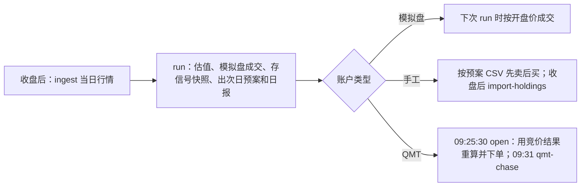

# 交易系统

把 `research/final_spec.py` 冻结的策略变成每天可以执行的流程：数据接入 → 收盘信号 → 开盘决策 → 下单 → 记账 → 风控 → 日报。策略逻辑不在这里重写，而是直接调用 `research/` 里的冻结代码。

**验证结论**：4 个冻结版本 × 4 个调仓偏移，共 16 组，在 2020-04 至 2026-09 用这套系统逐日回放（50 万元，整手、最低 5 元佣金、印花税、0.10% 滑点）。每一组每一天的收盘持仓都与研究回测**完全相同**，日收益相关系数 ≥ 0.99994。分区间年化与研究回测相差不超过 0.13 个百分点，单日最大差 0.09%，差异来自整手取整和费用从现金里扣。研究端 4 个偏移的均值与 `research/results/final_test_sealed_2025_2026.csv` 的预注册检验记录相差不到 1e-6。

## 每天怎么跑



所有命令都在仓库根目录运行（Python 3.11，依赖 numpy、polars、scipy；一次 `run` 约 1 分钟，峰值内存约 6 GB）。

1. **接入当日行情**（列与 `data/stock_price_v1` 相同，一天一个文件）：
   ```bash
   python -m trading ingest inbox/stock_price_20261008.parquet
   ```
   校验不过就拒收：日期必须接在已有数据之后、成交家数不少于前一日 95%、价格自洽、市值与股本单位正确。文件里的前复权列会被忽略，按 `qfq[t] = 原价[t] × qfq_close[t-1] / pre_close[t]` 重新链接（pre_close 是交易所除权参考价，2019–2026 年实测与前复权收益的中位差 8e-5）。
   没有现成数据源时可用聚宽：`JQ_USER=… JQ_PASS=… python -m trading.fetch_jq 2026-10-08 inbox/stock_price_20261008.parquet`（未在本环境联网验证）。
   ST、分红、上市日期等参考表更新后用 `python -m trading ingest-ref st_daily_intervals 新表.parquet` 整表替换。

2. **手工账户先导入券商持仓**（模拟盘和 QMT 跳过这一步）：
   ```bash
   python -m trading import-holdings --account my_account 持仓导出.csv --cash 52000.5
   ```
   支持「证券代码 / 股票余额 / 成本价」等常见表头和 GBK 编码；有入金出金时加 `--flow 金额`。

3. **收盘后运行**：
   ```bash
   python -m trading run                   # 所有 enabled 账户；或 --account paper_j1_50
   ```
   每个账户得到：
   - `trading/var/accounts/<账户>/reports/<日期>.md`：净值、回撤、次日预案、风控结果、持仓与行业、市场温度计（只作参考，不参与交易）
   - `trading/var/accounts/<账户>/orders/<次日>_preliminary.csv`：预案订单（先卖后买，手工账户带限价）
   - `snapshots/<日期>.npz`：次日开盘重算所需的全部信号输入

4. **开盘**：
   - 模拟盘：不用做任何事，下次 `run` 时按次日开盘价成交。
   - 手工：按 CSV 在集合竞价挂卖单，成交后再挂买单。预案按收盘价估算，开盘涨停买不到、跌停卖不掉的单子会留到下一次 `run` 自动补（持仓数与目标不符时，策略本身就会加仓或降仓）。
   - QMT：09:25:30 运行 `python -m trading open --account <账户> --live`，用竞价结果重新形成股票池和分数、按开盘价定数量，再下单；09:31 起 `python -m trading qmt-chase --account <账户> --live` 追单。不加 `--live` 或配置里 `allow_live = false` 时只打印、不下单。

其他命令：`status`（账户概况）、`resume --account X --note 原因`（解除回撤熔断）、`replay`（见下）。

## 账户配置

`trading/config/accounts/*.toml`，一个文件一个账户。策略参数**只能**选 `final_spec.py` 里的冻结版本，这里只决定券商、资金、起始日和调仓偏移。

| 文件 | 券商 | 版本 | 状态 |
| --- | --- | --- | --- |
| `paper_j1_50.toml` | 模拟盘 | MAIN J1-50（预注册主版本） | 启用，2026-10-08 起 |
| `paper_v0_50.toml` | 模拟盘 | CTRL V0-50（无股息） | 启用，2026-10-08 起 |
| `manual_example.toml` | 手工 | MAIN J1-50 | 模板，未启用 |
| `qmt_example.toml` | miniQMT | MAIN J1-50 | 模板，未启用，`allow_live = false` |

可调项：`[costs]`（佣金、最低 5 元、滑点、印花税）、`[risk]`（见下表）、`[execution]`（`cash_buffer` 买入时留的现金比例，`limit_band` 手工限价带宽，QMT 路径和资金账号）。

## 设计要点

- **开盘时决策，复现研究里的「次日可买」条件。** 研究的股票池要求标的在次日开盘可买（非涨停开盘、未停牌），分数在这个池子里排名。实盘这在 09:25 集合竞价后才知道，所以收盘时只存每只股票的原始输入（因子行、流动性、股息率、池子条件），开盘拿到竞价结果后再算分、选股、定量。
- **调仓规则与回测一致**：每 20 个交易日按锚点 2020-04-01 加偏移调仓；排名在 3×持仓数以内的老持仓保留；拥挤度触发时每天按 0.04 的步长降到 50% 仓位，平时整只卖最弱、买最强；J 版本在 1 月最后 10 个交易日空仓。
- **整手和现金约束**：买卖按 100 股取整（清仓可卖零股），不足一手的调整跳过，开盘跌停卖不掉导致现金不够时按比例缩减买单，再扣掉手续费后现金不为负。
- **成本**：佣金万 2.5（最低 5 元）、印花税（2023-08-28 前千一，之后万五，仅卖出）、滑点每边 0.10%，与 `final_spec.py` 一致。
- **除权**：模拟盘在除权日按「昨收 / 今日前收」放大股数，相当于分红送转再投入，与前复权回测口径一致。实盘以券商持仓为准。
- **决策可复现**：V9 版本里不分红股票的股息率并列，研究用一个随面板尺寸变化的随机矩阵打破并列；实盘改成只由（日期、代码）决定的伪随机数，同一天重跑结果不变。回放对账时用研究的原版。
- **交易日历**：历史交易日取自数据；未来日期按 `config/holidays.toml` 推算。2026 年已核对（国庆休市至 10-07，10-08 开市）。2027 年只录入了元旦，标记为暂定：会在日报里提示，1 月空仓窗口（2027-01-18 至 01-29）不受春节影响。未录入的年份直接报错，不会猜。
- **ST 双保险**：除了 ST 区间表，收盘时股票名称带 ST 或「退」的也排除，并在日报中提示更新区间表。

### 风控

| 检查 | 默认 | 触发后 |
| --- | --- | --- |
| 数据日期、成交家数覆盖率 ≥ 97%、股票池 ≥ 150 只 | — | 阻断当日订单 |
| 单边换手：调仓日 ≤ 120%，其他日 ≤ 计划增减只数 × 1.5 | — | 阻断 |
| 订单形状：整手、卖出不超过持仓、价格有效、单只目标权重 ≤ 6% | — | 阻断 |
| 回撤 | -20% 警告，-30% 熔断 | 熔断后只允许卖出，需 `resume` 人工解除；-30% 是最终检验预注册的失败线 |
| 单日亏损 | -7% | 警告 |
| 行业集中度（申万一级） | 35% | 警告 |
| 持仓停牌 | — | 警告 |

## 验证

```bash
python -m pytest trading/tests              # 单元测试（秒级）
python -m pytest trading/tests --slow       # 另外用真实数据核对：13 个因子、股息率、逐日分数与研究代码逐位相等；增量行情前复权链接
python -m trading replay --version "MAIN J1-50" --offset 0 --both     # 系统逐日回放 vs 研究回测
```

下表是 4 个偏移的均值（最大回撤取 4 个里最差的）。明细在 `results/replay_parity_2020_2026.csv`，逐组输出在 `results/replay_parity_2020_2026.txt`。

| 版本 | 区间 | 系统回放 年化 | 研究回测 年化 | 预注册记录 年化 | 系统 最大回撤 | 研究 最大回撤 | 持仓逐日一致 | 日收益相关 |
| --- | --- | --- | --- | --- | --- | --- | --- | --- |
| MAIN J1-50 | 2020-04..2024-12 | +32.6% | +32.5% | +32.5% | -20.0% | -19.9% | 100.0% | 0.99995 |
| MAIN J1-50 | 2025-01..2026-09 | +10.9% | +10.9% | +10.9% | -17.5% | -17.4% | 100.0% | 0.99995 |
| ALT  J1-30 | 2020-04..2024-12 | +31.9% | +31.9% | +31.9% | -19.8% | -19.7% | 100.0% | 0.99994 |
| ALT  J1-30 | 2025-01..2026-09 | +6.9% | +6.9% | +6.9% | -20.0% | -20.0% | 100.0% | 0.99994 |
| CTRL V9-50 (no Jan exit) | 2020-04..2024-12 | +29.6% | +29.5% | +29.5% | -20.0% | -20.0% | 100.0% | 0.99995 |
| CTRL V9-50 (no Jan exit) | 2025-01..2026-09 | +16.1% | +16.1% | +16.1% | -17.1% | -17.1% | 100.0% | 0.99995 |
| CTRL V0-50 (no dividend) | 2020-04..2024-12 | +32.1% | +32.0% | +32.0% | -20.3% | -20.3% | 100.0% | 0.99997 |
| CTRL V0-50 (no dividend) | 2025-01..2026-09 | +22.7% | +22.7% | +22.7% | -20.4% | -20.3% | 100.0% | 0.99997 |

慢速测试另外核对了：13 个因子与 `lib.build_factors` 逐位相等；股息率与 `signals.dividend_yield_ttm` 逐位相等；按开盘可买性逐日重算的 V0、V9 分数与研究分数矩阵逐位相等；增量行情的前复权链接正确；因子方向与训练期 IC 缓存一致。QMT 适配器用模拟的 xtquant 模块测了自身代码路径（持仓读取、竞价判断、先卖后买、价格、模拟运行不下单），没有连过真实终端。

## 已知限制

- **QMT 适配器没有在真实终端上跑过。** 它按 xtquant 的接口（`XtQuantTrader`、`StockAccount`、`xtdata.get_full_tick`）编写，默认只打印不下单。先在 QMT 模拟账户里跑通，再把 `allow_live` 打开。`fetch_jq.py` 同样未联网验证，但它的输出必须先过 `ingest` 校验。
- **数据要每天续上。** 系统不自带行情源：需要每天一个与 `stock_price_v1` 同列的日线文件。ST 区间表要定期刷新（名称兜底只是保险）；V9 版本用到分红表，也要刷新。
- **成交假设偏乐观。** 模拟盘按开盘价 ±0.10% 成交，没有冲击成本。小盘股实际可能更差：最终检验在 20bp 滑点下，主版本超额由 +0.6% 变成 -0.3%。资金规模只在 50 万元上测过：每只约 1 万元，最低流动性门槛 500 万元/日，占比约 0.2%；放大到几千万需要另做容量检验。
- **手工账户用的是收盘预案。** 它按前一收盘价定数量，开盘不重算；开盘涨停没买到的名额，下一次 `run` 才会补。这和回测「开盘当场换下一只」略有出入，QMT 路径没有这个差别。
- **未建模**：红利税（按持有期差别征收）、过户费、融资融券、北交所和科创板（策略本就不碰）。
- **冻结信号里的一个并列问题（保留未改）。** 综合分的「涨停」家族只有 `nlimup20` 一个因子，大多数股票 20 天内没有涨停、取值相同；研究代码按列位置（即股票代码顺序）打破并列，这和 GP 修正案第 3 条修掉的是同一类问题，但 `mainboard_scores` 里没有改。实测 2020-04 至 2026-09（每 5 天抽一天）：按代码打破并列时，沪市主板通过「剔除最差 30%」的比例是 67.0%，深市 73.4%；改用平均名次后是 72.0% 对 67.7%。约 5.5% 的股票通过与否会翻转，V0 前 50 名平均重合 97.6%（最低 78%）。系统忠实复现冻结版本；要改，应按研究流程先预注册再检验。
- **选哪个版本上实盘，需要你来定。** 预注册主版本 J1-50 在封存期年化 +10.9%，与股票池等权（+10.2%）基本持平，10bp 下勉强通过、20bp 下未通过。对照组 V0-50 封存期 +22.7%，但这个数字是看过之后才知道的，已经不是干净的样本外估计。所以两个模拟盘从 2026-10-08 起并行，前向记录才是干净的检验。
- **资源**：每次 `run` 读全量面板，约 1 分钟、峰值约 6 GB 内存；价格缓存约 1.5 GB 磁盘，新数据进来时重建（约 40 秒），只保留最新一份。
